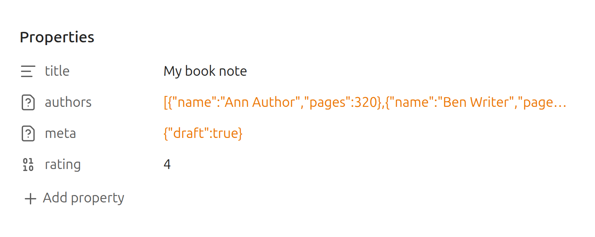
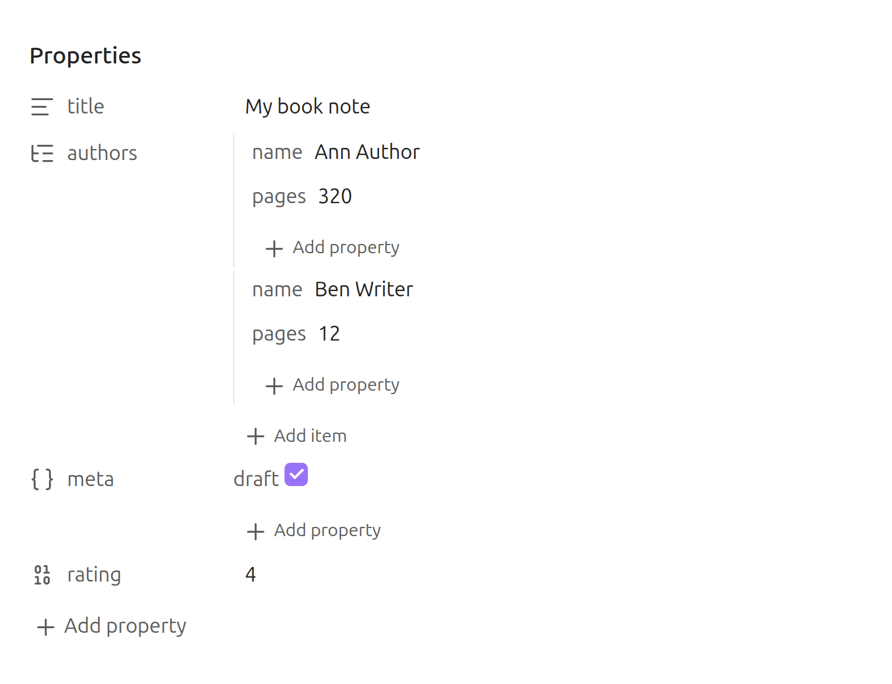
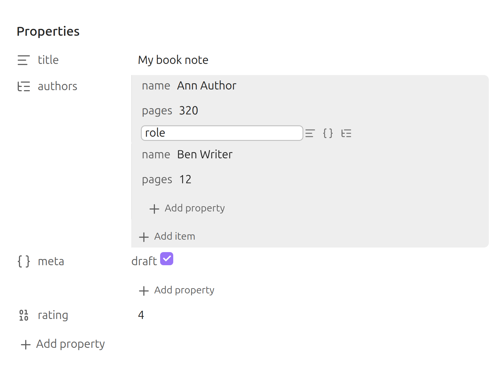

# Nested Frontmatter Properties

View and edit nested frontmatter properties — arrays of objects and nested
objects — directly in Obsidian's Properties panel, instead of the stock
"unsupported type" warning showing raw text.

## What it does

```yaml
---
title: My book note
authors:
  - name: Ann Author
    pages: 320
  - name: Ben Writer
    pages: 12
meta:
  draft: true
---
```

Without the plugin, Obsidian's Properties panel shows those values as raw text
with an "unknown type" warning:

<picture>
  <source media="(prefers-color-scheme: dark)" srcset="docs/img/properties-before-dark.png">
  
</picture>

With the plugin, the same `authors` and `meta` properties render as indented,
editable rows:

<picture>
  <source media="(prefers-color-scheme: dark)" srcset="docs/img/properties-after-dark.png">
  
</picture>

Values Obsidian already supports (text, lists of scalars, numbers, dates,
checkboxes) are never touched.

- Edit leaf values inline (text, number, checkbox inferred from the current value)
- Add and remove array items and object keys, choosing text, object, or list
  for each new value:

  <picture>
    <source media="(prefers-color-scheme: dark)" srcset="docs/img/add-property-dark.png">
    
  </picture>

- Everything is written back through Obsidian's public frontmatter API

## How this differs from Nested Properties

The [Nested Properties](https://github.com/mnaoumov/obsidian-nested-properties)
plugin covers similar ground with a larger feature set (vault-wide key renames,
type conversion, collapsible trees). This plugin is an independent,
from-scratch implementation with a different goal: the smallest possible
trusted surface. It ships under 10 KB with no bundled framework, no Electron
or Node API references, and a CI gate that keeps it that way.

## Design principles

This plugin is deliberately minimal, built to carry zero automated risk flags on
the community plugin store:

- **No network access, no telemetry, no dynamic code (`eval`), no clipboard or
  `localStorage` access, no Electron or Node APIs.** Works on mobile.
- **All writes use the public `processFrontMatter` API.** No YAML library is
  bundled; Obsidian does all parsing and serialization.
- **One runtime dependency**: [`monkey-around`](https://github.com/pjeby/monkey-around)
  (~1 KB), used to wrap a single method reversibly.
- **CI enforces the above**: every build greps the shipped bundle for forbidden
  tokens (`ipcRenderer`, `eval`, `innerHTML`, `fetch`, …) and fails if any appear.
  Releases carry GitHub build provenance attestation.

## Undocumented API notice

Obsidian has no public API for custom property widgets. To render inside the
native Properties panel, this plugin registers a widget in
`metadataTypeManager.registeredTypeWidgets` and wraps `getTypeInfo` so values the
stock UI marks unsupported resolve to it. This is plain in-renderer JavaScript at
the same privilege level as any plugin code — it grants no access beyond the
plugin sandbox. Every internal access is feature-detected: if a future Obsidian
update changes these internals, the plugin deactivates itself and the stock
behavior returns unchanged.

## Installation

Until listed in the community store: copy `main.js`, `manifest.json`, and
`styles.css` from the latest release into
`<vault>/.obsidian/plugins/nested-frontmatter-properties/`.

## Development

```bash
npm install
npm run dev      # watch build
npm test         # unit tests (pure edit/detect logic)
npm run build    # typecheck + production build + bundle token check
```
